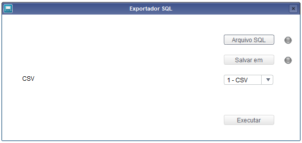
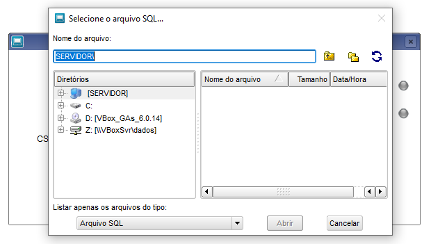
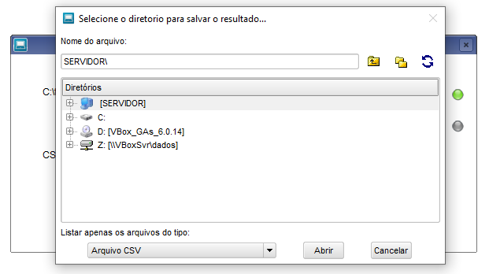
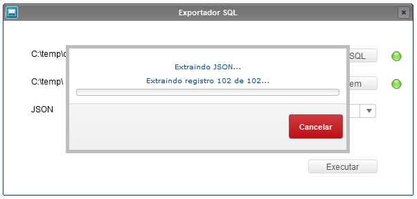
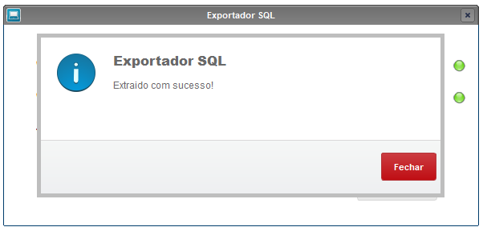

# tlpp-export-from-sql

Exportar em CSV ou JSON qualquer consulta SQL. Desenvolvida na linguagem TL++ (Linguagem proprietária da TOTVS)

 

1. [Definição](#Definição)
1. [Exemplo de execução](#Exemplo-de-execução)
1. [Observações](#Observações)

 

## Definição
Função construida para realizar extração de dados através de uma query no ERP Protheus da TOTVS, principalmente em ambientes TOTVS Cloud visto que a unica forma de realizar a extração é via TCloud e fica limitado a CSV. Então desenvolvi a função para realizar a extração nos formatos CSV e JSON.
A rotina realiza uma validação simples para evitar que alguns comandos sejam executados, visto que a rotina é apenas para consultas (SELECT), os comandos que são validados atualmente são:

- UPDATE
- DELETE
- TRUNCATE
- CREATE
- DROP
- INSERT

 

## Exemplo de execução
Fluxo de execução, ao acionar a rotina a tela abaixo é exibida.
 

 

Ao clicar no botão 'Arquivo SQL' a seguinte tela é aberta, para selecionar o arquivo SQL desejado.
 

 

Após selecionar o arquivo SQL devemos escolher o diretório para salvar o arquivo que será extraido.
 

 

Após selecionar o arquivo SQL, definir o diretório para salvar a extração e o formato, podemos observar que ao lado direito dos botões o status ficou na cor verde, indicando que são válidos, caso fiquem vermelhos, devem ser revisados antes de clicar em 'Executar'.
 

 

Tudo certo vamos executar a extração acionando o botão 'Executar', feito isso observamos a tela abaixo. (Obs.: A quantidade de dados sendo extraidos vai variar de acordo com o retorno, na imagem abaixo é apenas um exemplo.)
 

 

Ao final da rotina, após a extração ser concluida a seguinte mensagem é exibida.
 

 

## Observações
Dependendo do seu nível de conhecimento em Tl++ / Framework Protheus, você pode me perguntar porque não usei a classe 'JsonObject' para manipular a exportação no formato JSON. Optei por realizar a construção manual do arquivo JSON por 2 motivos simples:

- Toda query executada no protheus retorna os campos no formato String;
- Não sei o tamanho do retorno.

Vamos detalhor os motivos, quando executamos uma query que não seja por Embedded, ela sempre retorna os campos no formato String, sendo assim não preciso fazer tratamento dos dados. Sobre o tamanho do retorno a questão é a seguinte, como cada linha significa uma posição no array do arquivo JSON, caso tenhamos muitas linhas ficaria com desempenho defasado manter tudo em memória. Por esses 2 motivos construi a rotina gerando o arquivo JSON manualmente.